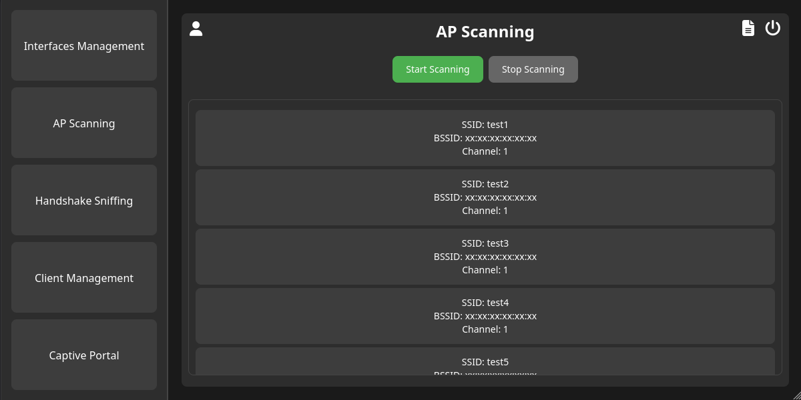
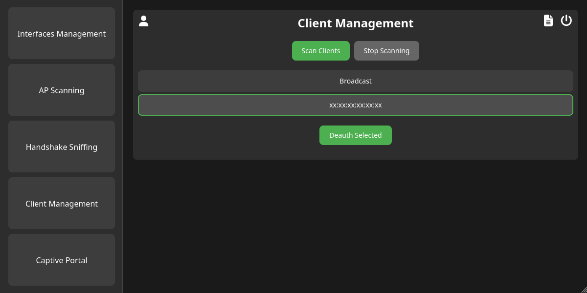
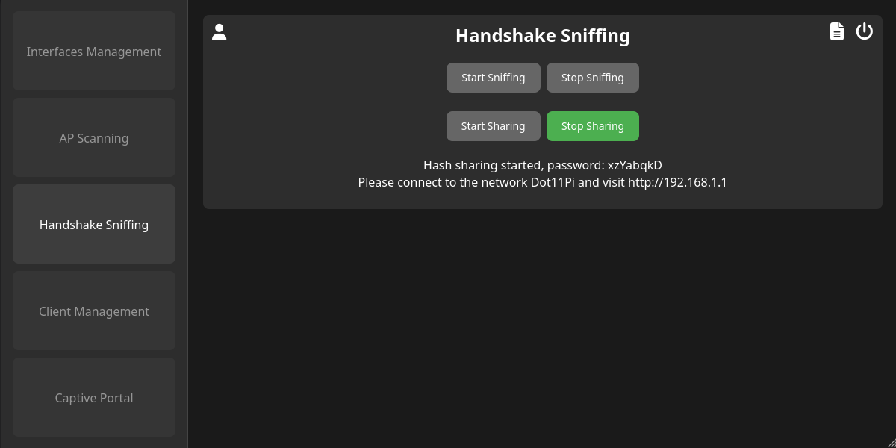
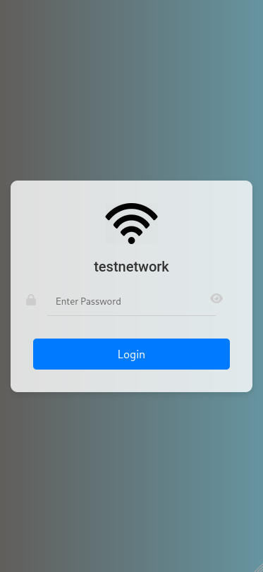
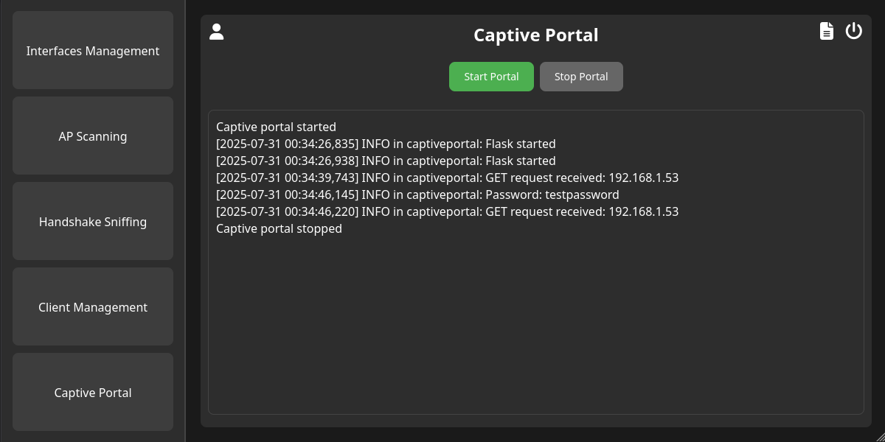
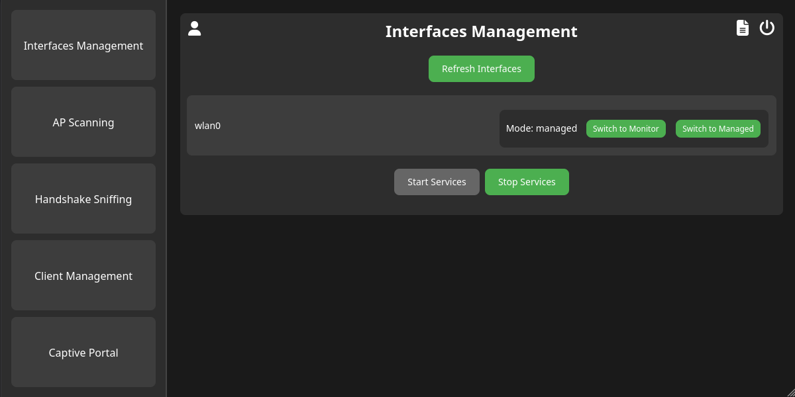

# 🔥 ElevenPi - Advanced WiFi Penetration Testing Platform

<div align="center">

**The Ultimate Raspberry Pi WiFi Security Assessment Tool**

[](LICENSE)
[](https://python.org)
[](https://raspberrypi.org)

*Transform your Raspberry Pi into a professional-grade wireless penetration testing device*

</div>

---

## 📖 **Table of Contents**

- [🚀 What is ElevenPi?](#-what-is-elevenpi)
- [✨ Core Features](#-core-features)
  - [🔍 Advanced Access Point Discovery](#-advanced-access-point-discovery)
  - [⚡ Deauthentication Attacks](#-deauthentication-attacks)
  - [🎣 WPA/WPA2 Handshake Capture](#-wpawpa2-handshake-capture)
  - [🕸️ Evil Twin & Captive Portal](#️-evil-twin--captive-portal)
  - [💻 Intuitive Web Dashboard](#-intuitive-web-dashboard)
- [🛠️ Technical Specifications](#️-technical-specifications)
- [🚀 Quick Start Guide](#-quick-start-guide)
- [📖 Detailed Usage Guide](#-detailed-usage-guide)
- [🔧 Advanced Configuration](#-advanced-configuration)
- [📊 Performance & Monitoring](#-performance--monitoring)
- [🔒 Security & Legal Notice](#-security--legal-notice)
- [📄 License & Credits](#-license--credits)

---

## 🚀 **What is ElevenPi?**

ElevenPi is a cutting-edge, all-in-one WiFi penetration testing platform designed specifically for Raspberry Pi devices. Built with Python and featuring a modern web interface, it combines the power of industry-standard tools like **aircrack-ng** with an intuitive user experience that makes wireless security testing accessible to both professionals and enthusiasts.

### 🎯 **Why ElevenPi?**

- **🖥️ Modern Web Interface** - No more command-line complexity. Manage everything through a sleek, responsive web GUI
- **🔄 Real-time Operations** - Live monitoring, instant feedback, and dynamic updates via WebSocket technology
- **🔄 Service-Based Architecture** - All components run as managed services via systemctl with comprehensive logging
- **📡 Complete WiFi Arsenal** - From AP scanning to credential harvesting, all tools in one packages
- **🔧 Plug & Play** - Automated installation and service management

---

## ✨ **Core Features**

### 🔍 **Advanced Access Point Discovery**
- **Multi-channel scanning** with intelligent channel hopping
- **Real-time AP detection** with signal strength monitoring
- **Interactive target selection** through the web interface



### ⚡ **Deauthentication Attacks**
- **Targeted client disconnection** for handshake capture
- **Broadcast deauth attacks** for maximum effectiveness



### 🎣 **WPA/WPA2 Handshake Capture**
- **Automated handshake detection** and validation
- **Instant notification** when handshakes are captured
- **Webdir hosting** to export handshakes and crack them



### 🕸️ **Evil Twin & Captive Portal**
- **Professional captive portal** mimicking legitimate login pages
- **Real-time credential harvesting** with instant logging
- **Automatic password validation** against captured handshakes




### 💻 **Intuitive Web Dashboard**
- **Real-time system monitoring** with live stats and graphs
- **Service management** with one-click start/stop controls
- **Interface configuration** with automatic mode switching



---

## 🛠️ **Technical Specifications**

### **System Requirements**
- **Hardware**: Raspberry Pi 3B+ or newer (Pi 5 recommended)
- **OS**: DietPi (for optimized performance)
- **WiFi**: Compatible USB WiFi adapter supporting monitor mode
- **Storage**: 8GB+ SD card (16GB recommended)
- **RAM**: 1GB+ (2GB+ for optimal performance)

### **Supported WiFi Adapters**
- **Recommended**: Alfa AWUS036ACH
- **Compatible**: Any adapter supporting monitor mode and packet injection
- **Chipsets**: Realtek RTL8812AU, Atheros AR9271, Ralink RT3070

### **Architecture Overview**
```
┌─────────────────┐    ┌──────────────────┐    ┌─────────────────┐
│   Web Frontend  │◄──►│  Flask Backend   │◄──►│  Core Engine    │
│   (HTML/JS/CSS) │    │  (WebSocket API) │    │  (Python/Scapy) │
└─────────────────┘    └──────────────────┘    └─────────────────┘
                                 │
                       ┌─────────▼─────────┐
                       │  System Services  │
                       │ (hostapd/dnsmasq/ │
                       │   aircrack-ng)    │
                       └───────────────────┘
```

---

## 🚀 **Quick Start Guide**

### **1. Download & Install**
```bash
# Clone the repository
git clone https://github.com/agente3z/ElevenPi.git
cd ElevenPi

# Run the automated installation (requires sudo) on a raspberry
sudo ./install.sh
```

### **2. Connect Your WiFi Adapter**
- Plug in your compatible USB WiFi adapter
- The system will automatically detect and configure it

### **3. Start Penetration Testing**
1. **Stop interfering services** via the dashboard
2. **Set your WiFi interface to monitor mode**
3. **Scan for target access points**
4. **Launch your chosen attack vector**
5. **Monitor results in real-time**

---

## 📖 **Detailed Usage Guide**

### **Interface Management**
The system automatically detects all available network interfaces and provides one-click mode switching between managed and monitor modes.

### **Service Control**
ElevenPi intelligently manages system services to prevent conflicts:
- **NetworkManager**
- **wpa_supplicant**
- **hostapd/dnsmasq**

### **Attack Workflows**

#### **WPA/WPA2 Handshake Capture Workflow**
1. Scan for target networks
2. Select target AP
3. Start sniffing for an handshake
4. Launch deauthentication attack
5. Wait for handshake capture

#### **Evil Twin Attack Workflow**
1. Select target network to clone
2. Start rogue access point
3. Monitor incoming connections
4. Harvest credentials in real-time
5. Let aircrack-ng validate captured handshakes against the previvously captured handshake

---

## 🔧 **Advanced Configuration**

### **DietPi Integration**
ElevenPi includes special integration for DietPi users:
- Automated startup configuration
- Custom installation scripts
- Optimized performance settings

---

## 📊 **Performance & Monitoring**

### **Logging & Reporting**
- **Comprehensive logging** of all operations and results through systemctl
- **Hash and credential storage** with organized file structure

---

## 🔒 **Security & Legal Notice**

### **⚠️ IMPORTANT DISCLAIMER**
ElevenPi is designed for **authorized penetration testing** and **educational purposes only**. 

**Legal Requirements:**
- Only use on networks you own or have explicit written permission to test
- Comply with all local, state, and federal laws
- Respect privacy and data protection regulations
- Use responsibly and ethically

**We are not responsible for any misuse of this tool.**

### **Ethical Guidelines**
- Always obtain proper authorization before testing
- Report vulnerabilities responsibly
- Respect user privacy and data
- Use findings to improve security, not exploit weaknesses

---

## 📄 **License & Credits**

### **License**
This project is licensed under the MIT License - see the [LICENSE](LICENSE) file for details.
